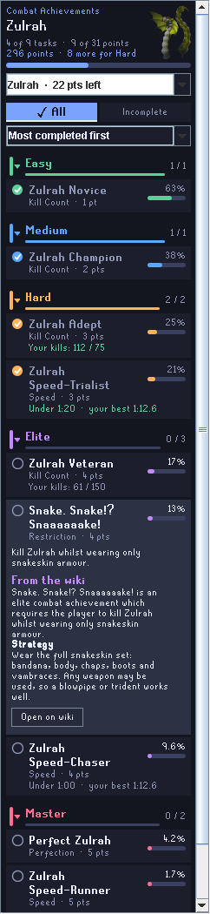
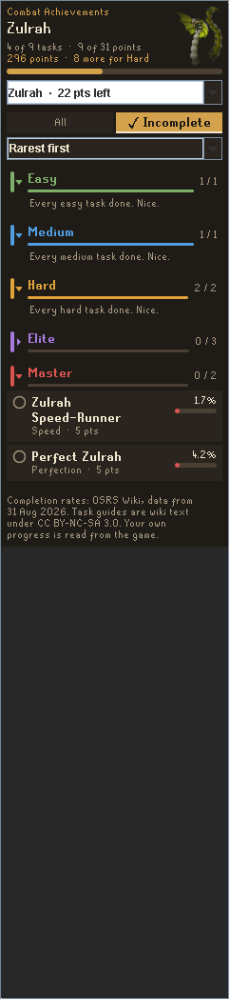
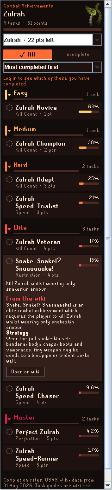
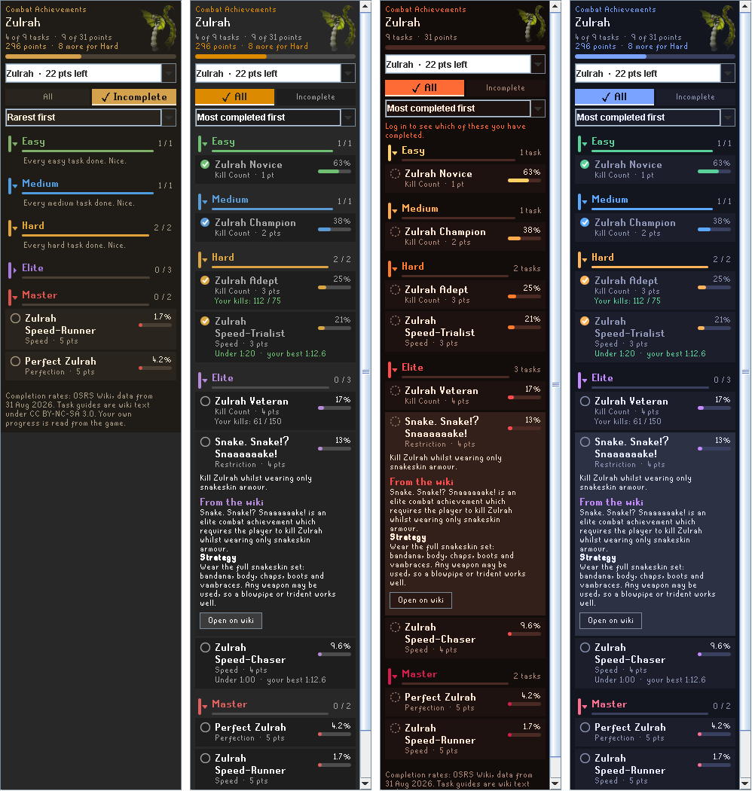

# CA Lookup: Combat Achievements

The complete Combat Achievements companion for RuneLite. It adds **CA Lookup** to the right-click menu of every boss and monster that has Combat Achievements.

Pick the option and the side panel shows that boss's tasks grouped by tier, the share of players who have completed each one according to the Old School RuneScape Wiki, a tick next to the ones you have already done, your own kill count or personal best where a task has a target, and a short wiki guide for any task you click.

<p align="center">
  
  
  
</p>

## Features

- **CA Lookup on monsters.** Right-click any boss, raid room, minion or Slayer monster that has tasks. Raid rooms offer every mode (for example Theatre of Blood, Entry Mode and Hard Mode) as chips at the top of the panel. JalTok-Jad offers both the Inferno and TzHaar-Ket-Rak's Challenges.
- **Grouped by tier.** Easy through Grandmaster, each in its own collapsible section with your count for that tier and a progress line. Sections you have finished start collapsed (optional).
- **Wiki completion rates.** Every task shows the percentage of players who have completed it, from the wiki's completion data. Tasks are sorted by that rate by default, so the most-completed tasks come first inside each tier. The footer says which day the wiki's numbers are from.
- **Your own progress, live.** Completion is read from your character's own game data, not the wiki, so it is correct the moment you get a task and needs no upload or logout. The panel refreshes itself when a task completes, and each character sees its own ticks the moment it logs in.
- **Your kill count and PB on the row.** Kill-count tasks show "Your kills: 61 / 150" and speed tasks show "Under 1:00, your best 1:12", read from the numbers RuneLite's Chat Commands plugin already records for your character. Raid speed tasks use the best for that team size only. The line turns green once your number meets the target.
- **Points to the next tier.** The header says how many points you have and how many more the next reward tier needs, using the game's own thresholds.
- **Boss portrait.** The boss's wiki image sits behind the header, faded into the panel, so every lookup has a face.
- **All or incomplete.** Two filter buttons, and a sort box with most-completed first, rarest first, or name. Tier sections are always kept whichever filter or sort is active, and switching is instant even with every task in the game on screen.
- **Quick wiki guide.** Click a task to expand its in-game description and a short plain-text summary of its wiki page (the opening paragraph and the Strategy section). **Open on wiki** opens the full page in your browser.
- **Browse any boss.** The drop-down at the top of the panel lists every boss group in the game, ordered by the points you can still earn there (shown next to each name), and narrows as you type. **(All)** at the top lists every task in the game, still grouped by tier and still filterable and sortable, with the boss named on each row.
- **Four themes.** Twilight (default), Slayer's Ledger, Inferno and RuneLite. Each colours the six tiers differently.

<p align="center">
  
</p>

## How to use it

1. Turn the plugin on in the RuneLite plugin list. A book icon appears in the sidebar.
2. Right-click a boss or monster and choose **CA Lookup**. The option sits just above Examine and never changes what a left-click does.
3. Or open the panel from the sidebar and type a name into the box at the top. Press Enter for the top match, or pick from the narrowed list.
4. Use **All** or **Incomplete** to hide what you have done, and the sort box to reorder inside each tier.
5. Click a task to read its description and the wiki's strategy notes. Click the tier header to collapse a tier.

## Settings

| Section | Setting | What it does |
| ------- | ------- | ------------ |
| Right-click menu | Add CA Lookup to monsters | Turn the menu option on or off |
| Right-click menu | Only with Shift held | Keep monster menus short and only add the option while Shift is held |
| Right-click menu | Menu option text | Rename the option |
| Panel | Open the side panel | Bring the panel to the front when you use the option |
| Panel | Theme | Colour palette |
| Panel | Default filter / Default sort | What a fresh lookup shows |
| Panel | Collapse finished tiers | Start a tier collapsed when every task in it is done |
| Wiki | Fetch from the wiki | Allow the wiki requests below. When off the plugin makes no network requests at all |

## Where the data comes from

- **Task list, tiers, types and boss groups** come from the game cache, the same structs the in-game Combat Achievements interface reads. Nothing is hard-coded except the mapping from NPC names to boss groups (for example Great Olm to Chambers of Xeric), which lives in `BossMatcher.java`.
- **Your completed tasks** come from your character's varps, again the same data the in-game interface shows. They are re-read on every login and whenever one of those values changes, so a task ticks itself off as soon as you complete it.
- **Kill counts and personal bests** are read from the `killcount` and `personalbest` settings that RuneLite's own Chat Commands plugin keeps per character. Nothing is fetched for them; if Chat Commands is off or has not seen a kill yet, the row simply shows no number.
- **Tier thresholds** come from the game's varbits, so a rebalance needs no plugin update.
- **Completion percentages** come from the wiki's published completion data at `Module:Combat Achievements/completion.json`, fetched together with the date of its latest revision. The plugin ships a snapshot of that file so the percentages are available offline, and replaces it with the live copy once fetched (again on login when the copy is more than 12 hours old).
- **Task summaries** come from the wiki's TextExtracts API, one small request for the task you clicked, cached for the session. Wiki text is [CC BY-NC-SA 3.0](https://creativecommons.org/licenses/by-nc-sa/3.0/) and every summary links to its page.
- **Boss portraits** come from the wiki's page-image API and the image it points to, cached for the session.

Network requests only go to `oldschool.runescape.wiki`, are read-only, identify the plugin in their User-Agent, and can be switched off entirely in the settings. The plugin never sends your character data anywhere and does not use the WikiSync API.

## Plugin Hub compliance

- Pure Java 11. No Kotlin, reflection, JNI, external processes, or downloaded code.
- No third-party dependencies beyond the standard build (RuneLite client, Lombok). HTTP goes through RuneLite's injected `OkHttpClient`; JSON through the injected `Gson`.
- Menu handling only **adds** one `RUNELITE` menu entry, placed next to Examine. It never removes, reorders, swaps or deprioritises existing entries and never changes the left-click action.
- It reads game state only: cache structs, enums and varps. It sends no input, automates nothing, and shows no in-fight overlays or mechanics helpers. It is a reference panel, in the same spirit as the built-in Wiki plugin.
- No user-supplied IDs. The alias table maps names, and the task list comes from the cache.
- Resources are loaded with `getResourceAsStream` (via `ImageUtil.loadImageResource` and directly for the bundled snapshot).
- All client data is read on the client thread; Swing is updated on the event thread; network callbacks hop to the event thread before touching the panel.
- `runelite-plugin.properties`, `icon.png` (48x48) and the BSD 2-Clause `LICENSE` are in place, and `build=standard`.

### How it differs from existing hub plugins

Nothing on the hub offers a right-click lookup on an NPC. The nearest neighbours:

- **Combat Achievements Tracker** is a full sidebar tracker with filters and a wiki link per task. No NPC menu option, no completion percentages, no in-panel guides.
- **Tasks Tracker** is a league and combat task list with export. No NPC option, percentages or guides.
- **CA Helper** and **Daily CA Picker** recommend which task to do next.
- **Combat Achievements Timers**, **Timers CA**, **CA Description Hider**, **Green Combat Achievements Menu**, **Restricted CA Tracker**, **CAChunk** and **Combat Achievement Exporter** do unrelated things.

## Building and running locally

Requires JDK 11 or newer.

```
./gradlew build      # compiles and runs the unit tests
./gradlew run        # launches RuneLite with the plugin loaded (developer mode)
```

On Windows use `gradlew.bat` instead of `./gradlew`. With a Jagex account, follow RuneLite's [Using Jagex Accounts](https://github.com/runelite/runelite/wiki/Using-Jagex-Accounts) guide once so the developer client can log in.

## Refreshing the bundled completion snapshot

The snapshot in `src/main/resources/com/calookup/completion-snapshot.json` is a copy of
`https://oldschool.runescape.wiki/w/Module:Combat_Achievements/completion.json?action=raw`.
Replace the file and update `SNAPSHOT_DATA_DATE` in `CompletionRates.java` (the page's latest revision timestamp) when you want a newer offline baseline.

## Project layout

```
src/main/java/com/calookup/
  CombatAchievementLookupPlugin.java  entry point, menu option, events, lookups
  CombatAchievementLookupConfig.java  settings
  CombatTaskRepository.java           reads tasks from the cache, completion from varps, tier thresholds
  CombatTask.java / TaskTier.java / TaskType.java
                                      task model
  BossMatcher.java                    NPC name to boss group mapping
  BossOption.java                     drop-down entries ordered by points still available
  ProgressReader.java / TaskProgress.java
                                      kill counts and PBs from Chat Commands data
  WikiClient.java                     the wiki requests
  WikiSummary.java                    turns a page extract into a short summary
  CompletionRates.java                completion percentages, live or bundled snapshot
  TaskArranger.java                   filter and sort logic
  LookupView.java                     immutable snapshot handed to the panel
  LookupPanel.java                    the sidebar panel
  PortraitHeader.java                 header with the boss image
  SearchableComboBox.java             the type-to-search boss box
  TierSection.java / TaskRow.java     tier headings and task rows
  RateBar.java / StatusMark.java      small painted components
  Theme.java                          colour palettes
src/main/resources/com/calookup/
  icon.png                            sidebar icon
  completion-snapshot.json            bundled wiki completion data
src/test/java/com/calookup/           unit tests and the developer-mode launcher
docs/                                 screenshots
```

## License

BSD 2-Clause. See [LICENSE](LICENSE).
